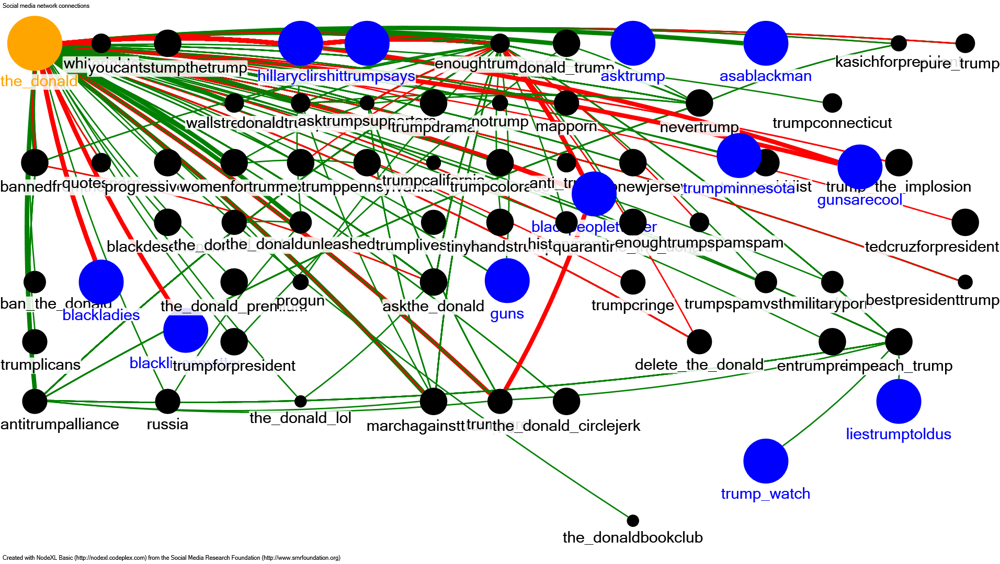
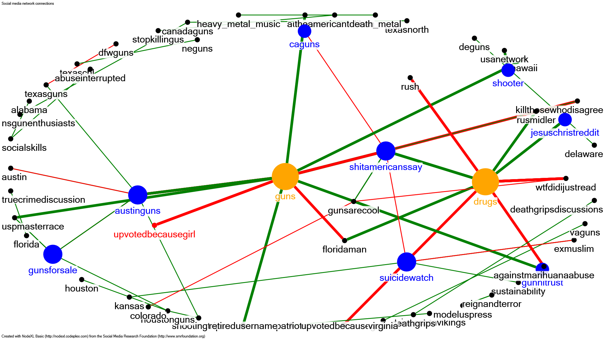
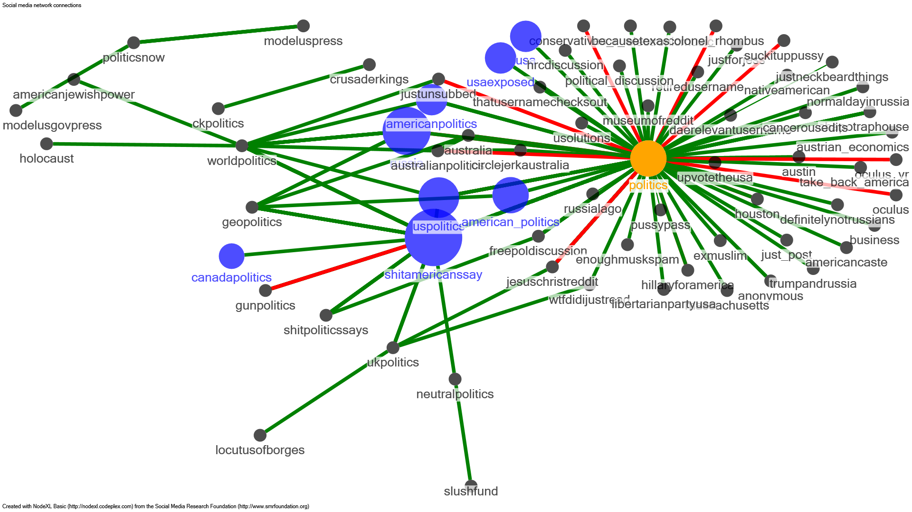
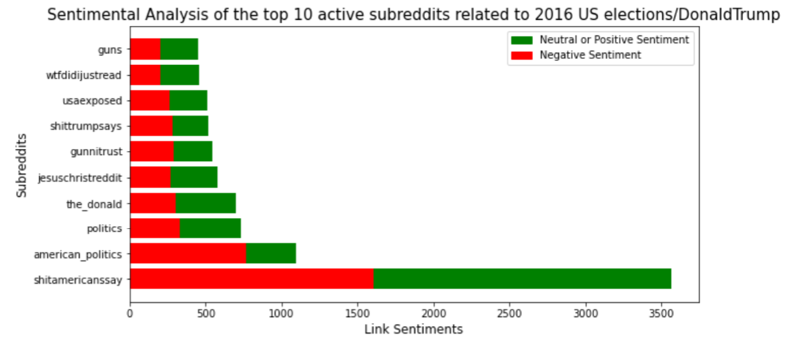
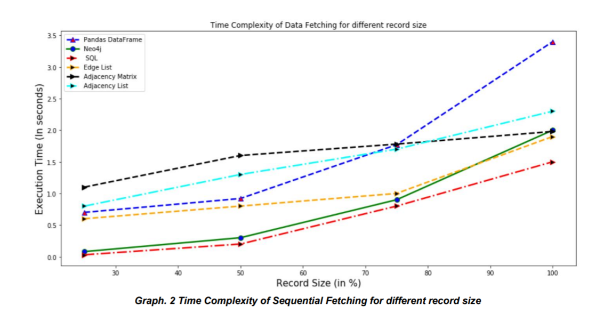

# Reddit Hyperlink Graph Network :metal:

Reddit is an American online community of message forums that is organized into over one million
user-created and user-moderated communities known as subreddits. Alongside mainstream
subreddits for discussing scientific discoveries and internet memes, during the recent 2016 US
elations Reddit has seen an increase in 'Toxic and Harmful' subreddits, that promote violence, hate
speech and racism in communities.  

<b> Goal </b> : The goal of our investigation is to come up with appropriate data modeling, data storage and data
visualization techniques to help us analyze the large SNAP Stanford reddit dataset in an efficient and
scalable way, and identify these harmful and toxic subreddits

## Dataset :cloud:
To facilitate our investigation, we are using the SNAP Sandford ‘Social Network: Reddit Hyperlink
Network’ dataset. This dataset is a collection of monthly user interaction networks derived from
multiple publicly available subreddit communities on reddit.com from 2014 to 2017. The datset
consists of two TSV files, each of which provides links from the source sub-reddit to the target subreddit. Both files include hyperlinks that are referenced in the body and title of a subreddit.  
Dataset can be downloaded from - https://snap.stanford.edu/data/soc-RedditHyperlinks.html

## Packages and concepts used :computer:
<ul>
  <li>Python (Pandas, Matplotlib)</li>
  <li>SQL</li>
  <li>NodeXL</li>
  <li>Graph Data Structure:</li>
  - Edge List  
  - Adjacency List  
  - Adjacency Matrix  
</ul>

## Insights :pencil:
### Insight : What are the most active/ user engaged Crime related subreddit groups in USA?  

### Insight : Relationship between active subreddits in US that are related to Crime.  

### Insight :  Most influential subreddits in US Politics  

### Insight :  Sentimental Analysis of the top 10 active subreddits related to US elections / Donald Trump.  

### Insight :  Execution Time for Fetching of records of different sizes  

